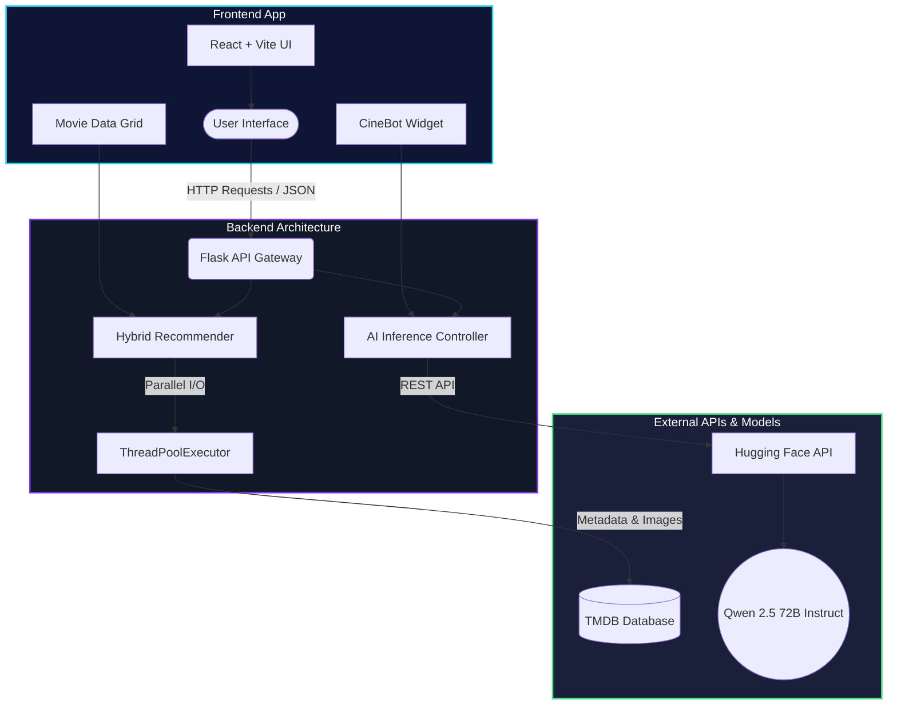

<div align="center">


# CINEMATIQ

### Next-Generation AI-Powered Movie & Series Platform

*Discover what to watch next — with absolute intelligence.*

[](https://react.dev)
[](https://python.org)
[](https://flask.palletsprojects.com)
[](https://huggingface.co/)
[](https://themoviedb.org)

</div>

---

## 🎬 What is Cinematiq?

**Cinematiq** is a production-ready, full-stack cinematic intelligence platform. It moves beyond standard catalogs by integrating a **Hybrid Recommendation Engine** and a built-in **Conversational AI Expert (CineBot)**. The platform is designed with a premium, pixel-perfect dark-mode aesthetic aimed at delivering a highly immersive user experience.

---

## 🏗️ System Architecture & Workflow

Cinematiq utilizes a decoupled client-server architecture, allowing seamless asynchronous data fetching and real-time AI inference.



### 🔄 Data Workflow
1. **User Request**: The user interacts with the UI (searches for a movie or talks to CineBot).
2. **Parallel Fetching**: The Python backend receives the request and utilizes `ThreadPoolExecutor` to fetch massive amounts of metadata concurrently from the TMDB dataset, reducing page load times to under ~1.5s.
3. **AI Inference**: Chat requests are routed via the Hugging Face `InferenceClient`, applying strict system prompts to maintain character, and streamed back to the frontend.

---

## 🧠 AI Models & Datasets

### 1. Conversational AI Model (CineBot)
Cinematiq features a dedicated AI assistant powered by state-of-the-art open-source Large Language Models.

* **Model Used**: `Qwen/Qwen2.5-72B-Instruct`
* **Architecture**: 72 Billion Parameter Transformer
* **Provider**: Hugging Face Serverless Inference API
* **Configuration Parameters**:
  * `temperature`: **0.7** (Balances creativity with factual movie accuracy)
  * `max_tokens`: **250** (Ensures concise, readable, and snappy responses)
  * `system_prompt`: Enforces strict cinematic-only topic adherence and explicit year formatting `e.g. Inception (2010)`.

### 2. Dataset Engine
* **Primary Database**: The Movie Database (TMDB) API
* **Data Scale**: Real-time access to 1,000,000+ movies, cast members, and high-resolution posters.
* **Accuracy/Filtering**: Strict backend algorithms strip out movies without valid posters/metadata to ensure a 100% clean visual grid.

---

## 🛠️ Technology Stack

| Category | Technologies Used |
|---|---|
| **Frontend UI** |     |
| **Backend API** |   |
| **AI Integration**|  `huggingface_hub` |
| **Deployment** |   |

---

## 💻 Local Installation & Setup

### 1. Clone the Repository
```bash
git clone https://github.com/kumardhruv88/cinematic.git
cd cinematic
```

### 2. Configure Environment Variables
Create a `.env` file inside the `backend/` directory:
```env
TMDB_API_KEY=your_tmdb_api_key
TMDB_ACCESS_TOKEN=your_tmdb_read_access_token
HF_TOKEN=your_hugging_face_token
```

### 3. Start the Backend (Python/Flask)
```bash
cd backend
python -m venv venv
# Windows: venv\Scripts\activate | Mac/Linux: source venv/bin/activate
pip install -r requirements.txt
python app.py
```

### 4. Start the Frontend (React/Vite)
```bash
cd frontend
npm install
npm run dev
```

The application will now be running live at `http://localhost:5173`.

---

## 🔒 License
This project is proprietary or licensed under the [MIT License](LICENSE).

<div align="center">
  <br>
  <i>Designed for cinephiles. Powered by AI.</i>
</div>
